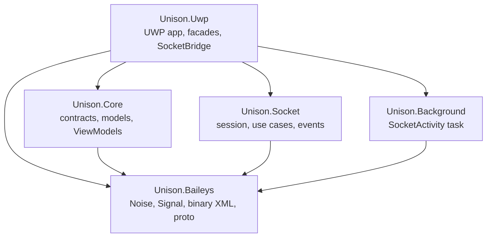
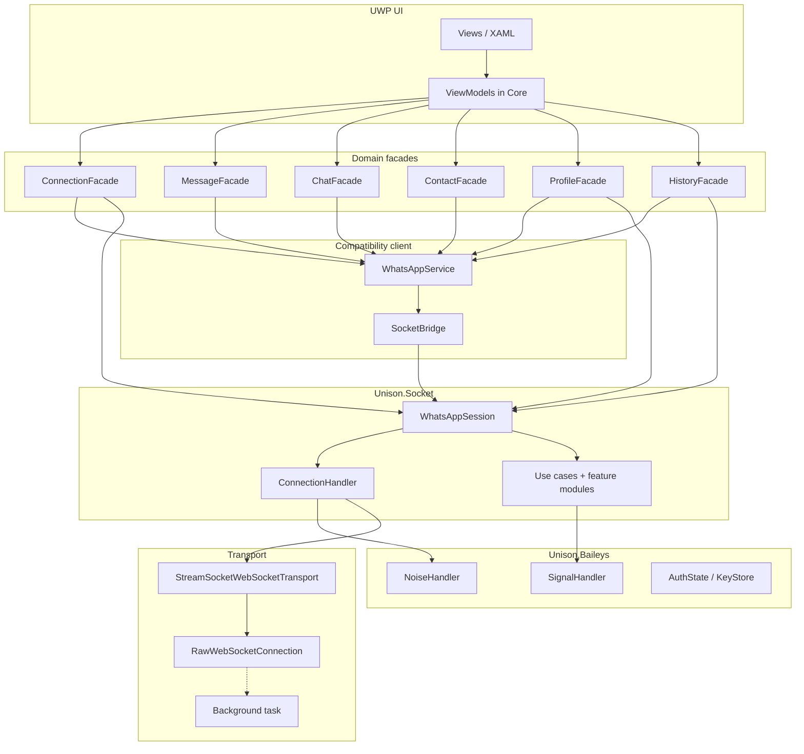

# Architecture

Unison is split so that **WhatsApp protocol and session** live in a portable library, while **UWP** owns UI, persistence, and platform adapters. ViewModels talk to **domain facades**. Facades talk either to `Unison.Socket` (new path) or to `WhatsAppService` (compatibility client). The background task still owns the **raw TCP socket** when the app is suspended; transferring that socket onto the new stack is a later step.

## Design rules

1. **Wire ≠ domain.** `ConnectionHandler` connects, handshakes, frames, and correlates IQs. It never calls a use case and never holds chats or messages.
2. **Session ≠ host.** `WhatsAppSession` is the small composition root (`makeWASocket` over `makeSocket`). Feature modules attach to its dispatcher. Reconnect policy lives in the UWP host.
3. **Facades own policy.** Screens subscribe to `IConnectionService`, `IMessageService`, `IContactService`, and the other WhatsApp contracts — not to raw client events.
4. **Core has no XAML.** `Unison.Core` is netstandard2.0. WinRT types stay in `Unison.Uwp` behind interfaces.
5. **Background has no Core.** The out-of-process task references only `Unison.Baileys`, so it can decode frames and show toasts without pulling in ViewModels.

## Project graph

| Project | Target | Role |
|---|---|---|
| `Unison.Uwp` | UAP 10.0.16299+ | App, views, DI, stores, `SocketBridge` |
| `Unison.Core` | netstandard2.0 | Contracts, models, ViewModels, helpers |
| `Unison.Socket` | netstandard2.0 | Baileys 7.0.0-rc14 session and protocol |
| `Unison.Baileys` | netstandard2.0 | Crypto, Noise, Signal, protobuf, `AuthState` |
| `Unison.Background` | UAP winmdobj | Out-of-process broker; **no** Core / Socket reference |

Solution file: `Unison.slnx`. Ignore the nested stub `src/Unison.Socket/Unison.Socket/` (empty WinUI project). The real library is `src/Unison.Socket/Unison.Socket.csproj`.

## Runtime layers

Solid arrows are the live path. The dashed arrow to the broker is **implemented in the UWP transport** but **not yet called** by `SocketBridge`. See [Background broker](Background-Broker) and [Migration](Migration).

## Mental model: three owners

| Concern | Owner | Examples |
|---|---|---|
| Wire | `ConnectionHandler` | WebSocket, Noise handshake, IQ correlation, keep-alive |
| Protocol operations | Use cases + modules | send, receipts, retries, media, groups, USync, app-state, history |
| Domain policy + UI state | Facades + `WhatsAppService` | when to refresh names, chat list, persist, composer |

v6.9 already split **connection client vs policy**. The socket PR then split the **client** itself: protocol/session moved into `Unison.Socket`; `WhatsAppService` remains the in-memory chat store and send/history body until those flows finish migrating.

## SocketBridge

`Unison.Uwp/Client/SocketBridge.cs` implements the legacy `IWhatsAppSocket` over `WhatsAppSession`.

That is intentional:

- `WhatsAppService` already talked to one connection through `IWhatsAppSocket`.
- Replacing the connection first, without dismantling the 16k-line client in the same step, is how a real account could move onto rc14.
- Facades that are ready (`ConnectionFacade`, `HistoryFacade`, `ProfileFacade`, parts of `ContactFacade`) reach `WhatsAppSession` directly via `IWhatsAppSessionProvider`.

Three things the bridge **does not fake**:

1. **Broker transfer** — both methods return `false`; the caller keeps the socket.
2. **Legacy app-state raw events** — `AppStateModule` decodes patches inside the session; changes arrive as callbacks.
3. **Cold restore of a broker-owned socket** — the bridge always opens a new transport.

## WhatsAppService today

Still the singleton `IWhatsAppService` registered in `App.ConfigureServices`. It still owns:

- Connect / resume / persist
- In-memory `Chats` collection and message caches
- History-sync body and outbox/send transport
- Avatar apply + group fallbacks
- Presence subscribe
- Memory-pressure and suspend hooks

Facades extracted **policy** around it (pairing/logout, pin/mark-read, contact overlay, profile picture IQ, history resync that waits for the phone). Screens should not subscribe to its raw events; those are for facades only (stated on `IWhatsAppService`).

## Data that persists

| Store | Where | What |
|---|---|---|
| `AuthStore` | `LocalSettings` container `WhatsAppAuth` | Credentials (`AuthState` JSON) |
| `FileKeyStore` | `SignalKeys\` | Sessions, prekeys, sender keys, app-state keys |
| `SqliteLidMappingStorage` | SQLite | PN ↔ LID map for the rc14 addressing model |
| `ChatStore` / `PersonStore` / `MessageStore` | App data | Chat list, people, messages |
| Broker journal | `broker-frame-*.bin` (UBJ2 / UBD3) | Ordered frames + Noise checkpoint while backgrounded |

## Where to go next

- Protocol internals → [Socket stack](Socket-Stack)
- Facades, DI, ViewModels → [Application layer](Application-Layer)
- How to write new code → [Coding standards](Coding-Standards)
- Suspended socket and toasts → [Background broker](Background-Broker)
- Shell, chat UI, i18n → [UI and shell](UI-and-Shell)
- Remaining work → [Migration](Migration)
