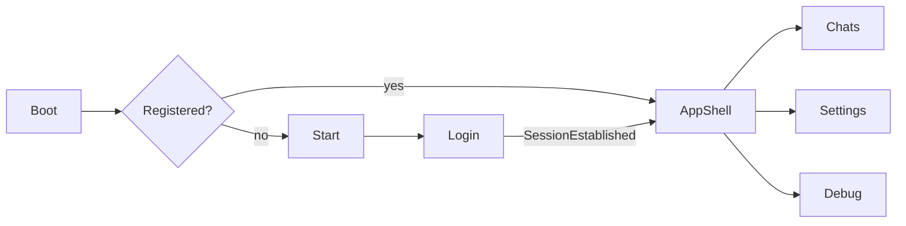

# UI and shell

Unison’s UI is a UWP app (`Unison.Uwp`) with ViewModels in `Unison.Core`. Target: **Windows 10 Mobile** first, desktop UWP second. Min version **10.0.16299**. UI stack includes **WinUI 2.7** (`Microsoft.UI.Xaml` 2.7.3).

How to add views, controls, and dialogs: [Coding standards](Coding-Standards).

## Navigation

Routes live in Core (`NavigationRoutes`). Page types live only in `NavigatorService` (UWP). Auth boundaries use `NavigateAndClear` (no back stack into login).



| Route | Page | Frame |
|---|---|---|
| `boot` | `BootView` | Root |
| `start` | `StartView` | Root |
| `login` | `LoginView` | Root |
| `appshell` / `main` | `MainView` | Root (SplitView shell) |
| `chats` | `ChatsView` | Shell content |
| `settings` | `SettingsView` | Shell content |
| `debug` | `DebugView` | Shell content |

`App.OnLaunched` and toast cold-start always go to **Boot**, not straight to Main. `ShellViewModel.InitializeAsync` decides Start vs AppShell.

Master-detail stays on `ChatsView` (list + detail), not a Frame push between list and conversation.

### Boot shell

Extended splash: animations, language already applied, ~3s dwell, then `FinishBootRootNavigation()`. After pairing, login can return through Boot (`postPairing`) so the connected surface loads with the same animation path.

### Login

`LoginViewModel` talks **only** to `IConnectionService`:

- QR from `ConnectionUpdate` (refreshed after timeout; cleared on disconnect so it cannot stick)
- Phone-number pairing code
- **QR pop-up** for low-resolution devices (`QrCodeFullscreenDialog`)

### Settings shell

Account block (push name, phone, avatar), disconnect/logout, language, shell theme, collaborators with GitHub links. `SettingsViewModel.LogoutAsync` goes through `IConnectionService` (server logout + local wipe).

**Shell reload** restarts the app after theme/language changes that require a new resource context.

## Themes

`IShellThemeService` swaps `Themes/{Unison|WhatsApp}/Theme.xaml`.

| `AppShell` | Look |
|---|---|
| `Unison` (default) | Unison chrome, including the **white / light** theme |
| `WhatsApp` | WhatsApp-like shell |

Persisted as `LocalSettingsConstants.SelectedShell`. `App.xaml` merges Unison first. Changing shell persists and reloads.

## Localization

Language packs are **in the main package** (not resource packs). That fixes sideload on Windows 10 Mobile, where a bundle would otherwise install only OS + pt-BR and `PrimaryLanguageOverride` would fall back incorrectly.

Shipped tags: `en-US`, `pt-BR`, `es-ES`, `it-IT`, `nl-NL`, `id-ID`, `pl-PL`, plus **System** (OS preferred → first shipped match → English).

`IAppLanguageService` applies the override in the `App` constructor **before** `InitializeComponent`, so `x:Uid` resolves on first frame. Selector exists on Boot and Settings. Missing strings fall back to English.

## Chat list

- `ChatListViewModel` + `IChatStateStore` (not the client collection directly)
- Preview uses `LastMessageKind` / `ChatListPreviewStrip`
- `ChatKind`: Direct, Group, Personal (“Message yourself”)
- Pin to Start: `IShortcutService` / live tiles (`ILiveTilesService`)
- Navbar on the Minimal (Windows 10 Mobile) shell no longer opens by accident

Safe-mode during initial history sync can still keep `VisibleChats` mirrored in code-behind so the list does not thrash.

## Conversation

### Bubbles

Each message is a `ChatMessageViewModel`:

- Text, images, video, voice/audio, documents
- Quotes and reactions
- Pin, download, open/save
- Placeholder + progress until on-demand media is fetched

Templates use bubble masks under `Assets/Bubbles/`.

### Composer

See [Application layer](Application-Layer#chatdetail-composer). Overlay while recording:

```
[ red dot ]  0:12          [ Cancel ]  [ Send ]
```

Normal attach / text / mic hides until the session stops.

### Image / video viewers

- **Image:** pinch zoom (`ScrollViewer` 1×–5×), wheel/trackpad toward cursor, double-tap 1× ↔ 2.5×, chrome fade on tap, share/save
- **Video:** fullscreen, statement update on the message

### Chat info

`ChatDetailInfoViewModel` — user and group variants (`CreateUser` / `CreateGroup`):

- Account pin via `IChatService` (synchronized with the phone through app-state patches)
- Local mute / Start tile
- Media and files panes from `IMessageStore`

## Notifications and tiles

Foreground and background share the toast shape (circular avatar, group vs direct layout). Pin Tile puts a conversation on the Start screen.

## Behaviors

A large set of former code-behind interactions is bound with **Microsoft.Xaml.Behaviors** so views stay declarative and ViewModels own commands.

## Platform adapters worth knowing

| Concern | Service |
|---|---|
| Mic capture | `AudioRecordingService` (singleton) |
| Earpiece vs speaker | `VoicePlaybackRoutingService` |
| Image send preview | `DialogService` + `ImageSendPreviewDialog` |
| New chat by number | `NewChatDialog` + `NewChatDialogViewModel` |
| Share / save image | `ShareService` / `IFilePicker.PickSaveLocalImageAsync` |

Folder rules, bindings, and dialogs: [Coding standards](Coding-Standards).
