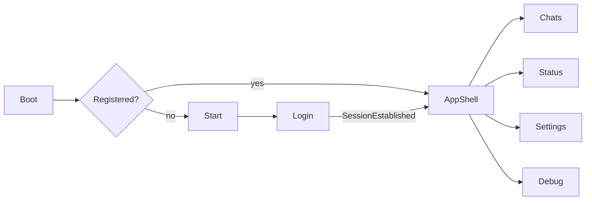

# UI and shell

Unison’s UI is a UWP app (`Unison.Uwp`) with ViewModels in `Unison.Core`. Target: **Windows 10 Mobile** first, desktop UWP second. Min version **10.0.16299**. UI stack includes **WinUI 2.7** (`Microsoft.UI.Xaml` 2.7.3).

How to add views, controls, and dialogs: [Coding standards](Coding-Standards).

## Navigation

Routes live in Core (`NavigationRoutes`). Page types live only in `NavigatorService` (UWP). Auth boundaries use `NavigateAndClear` (no back stack into login).



| Route | Page | Frame |
|---|---|---|
| `boot` | `BootView` | Root |
| `start` | `StartView` | Root |
| `login` | `LoginView` | Root |
| `appshell` / `main` | `MainView` | Root (SplitView shell) |
| `chats` | `ChatsView` | Shell content |
| `status` | `StatusView` | Shell content |
| `settings` | `SettingsView` | Shell content |
| `debug` | `DebugView` | Shell content |

`App.OnLaunched` and toast cold-start always go to **Boot**, not straight to Main. `ShellViewModel.InitializeAsync` decides Start vs AppShell.

Master-detail stays on `ChatsView` and `StatusView` (list + detail), not a Frame push between list and conversation.

### Status

Shell pane item `status` opens `StatusView` (same WideBoth / NarrowList / NarrowDetail geometry as chats). `StatusListView` is one row per author; `StatusDetailView` is a black photo-style viewer:

- White progress segments at the top (one per item)
- Photo / sticker: 5s; video: proto `Seconds`, or `MediaElement.NaturalDuration` when 0
- Auto-advance the ring; close after the last item (narrow returns to the list; wide clears the pane)
- Tap left/right previous/next; back closes
- Media download on open via `IStatusService.EnsureMediaAsync` (same SQLite keys as chat). Missing key → placeholder, no crash

Posting Status, view receipts, and reply are out of scope.

### Boot shell

Extended splash: animations, language already applied, ~3s dwell, then `FinishBootRootNavigation()`. After pairing, login can return through Boot (`postPairing`) so the connected surface loads with the same animation path.

### Login

`LoginViewModel` talks **only** to `IConnectionService`:

- QR from `ConnectionUpdate` (refreshed after timeout; cleared on disconnect so it cannot stick)
- Phone-number pairing code
- **QR pop-up** for low-resolution devices (`QrCodeFullscreenDialog`)

### Settings shell

Account block (push name, phone, avatar), disconnect/logout, language, **time format** (24-hour vs 12-hour AM/PM), shell theme, collaborators with GitHub links. `SettingsViewModel.LogoutAsync` goes through `IConnectionService` (server logout + local wipe). Toggle **Show Unison contacts in Windows** (off by default) publishes 1:1 chats into a Unison `UserDataAccount` in People via `IContactService` (Unigram-shaped list + annotations; not the user agenda).

Clock preference is `LocalSettingsConstants.TimeFormat` (`TimeFormat.Hours24` default). It does **not** change stored message stamps — only how `WhatsAppMapper` / `LocalTimeConverter` format device-local times after `ToDeviceLocal`.

**Shell reload** restarts the app after theme/language changes that require a new resource context.

## Themes

`IShellThemeService` swaps `Themes/{Unison|WhatsApp}/Theme.xaml`.

| `AppShell` | Look |
|---|---|
| `Unison` (default) | Unison chrome, including the **white / light** theme |
| `WhatsApp` | WhatsApp-like shell |

Persisted as `LocalSettingsConstants.SelectedShell`. `App.xaml` merges Unison first. Changing shell persists and reloads.

## Localization

Language packs are **in the main package** (not resource packs). That fixes sideload on Windows 10 Mobile, where a bundle would otherwise install only OS + pt-BR and `PrimaryLanguageOverride` would fall back incorrectly.

Shipped tags: `en-US`, `pt-BR`, `es-ES`, `it-IT`, `nl-NL`, `id-ID`, `pl-PL`, `uk-UA`, `ru-RU`, plus **System** (OS preferred → first shipped match → English).

To add another locale, see [Adding languages](Adding-Languages).

`IAppLanguageService` applies the override in the `App` constructor **before** `InitializeComponent`, so `x:Uid` resolves on first frame. Selector exists on Boot and Settings. Missing strings fall back to English.

## Chat list

- `ChatListViewModel` + `IChatStateStore` (not the client collection directly)
- Preview uses `LastMessageKind` / `ChatListPreviewStrip`
- `ChatKind`: Direct, Group, Personal (“Message yourself”)
- Pin to Start: `IShortcutService` / live tiles (`ILiveTilesService`)
- Navbar on the Minimal (Windows 10 Mobile) shell no longer opens by accident

Safe-mode during initial history sync can still keep `VisibleChats` mirrored in code-behind so the list does not thrash.

## Conversation

### Bubbles

Each message is a `ChatMessageViewModel`:

- Text, images, video, voice/audio, documents
- Quotes and reactions
- Pin, download, open/save
- Placeholder + progress until on-demand media is fetched

Templates use bubble masks under `Assets/Bubbles/`.

### Composer

See [Application layer](Application-Layer#chatdetail-composer). Overlay while recording:

```
[ red dot ]  0:12          [ Cancel ]  [ Send ]
```

Normal attach / text / mic hides until the session stops.

### Image / video viewers

- **Image:** pinch zoom (`ScrollViewer` 1×–5×), wheel/trackpad toward cursor, double-tap 1× ↔ 2.5×, chrome fade on tap, share/save
- **Video:** fullscreen, statement update on the message

### Chat info

`ChatDetailInfoViewModel` — user, group, and group-member variants (`CreateUser` / `CreateGroup` / `CreateGroupMember`):

- Account pin via `IChatService` (synchronized with the phone through app-state patches)
- Local mute / Start tile (hidden on the member pane)
- Media and files panes from `IMessageStore` (member pane filters by participant JID)
- Group Members pivot binds `ChatItem.GroupMembers` (persisted roster + optional avatars); tap opens member info
- Member profile replaces Notifications with **groups in common** from SQLite `PersonGroup` (includes the group you are viewing; LID/PN/phone aliases on write and read)
- **Add contact** (`ChatDetail_AddContact.Text`) under the phone on 1:1 and member info, on the green info command bar (1:1 only), plus the chat-list long-press and 1:1 overflow. Shown when a phone can be resolved (PN JID, alias, or `Person.Phone`). Hidden only when that full number is already in the **user** agenda (not the Unison People export, not a last-10-digit collision). `IContactService` decides; `ILocalContactsService` opens People (`ShowFullContactCard` on desktop so Windows 11 does not dismiss the flyout; mini-card on Mobile after the menu has closed)

**Shell split (do not collapse back into one host):**

| Surface | Control |
|---|---|
| 1:1 user + group | `ChatDetailInfoControl` → `ChatDetailUserInfoControl` / `ChatDetailGroupInfoControl` |
| Group member | `ChatDetailGroupMemberInfoPane` → `ChatDetailGroupMemberInfoControl` |

`ChatDetailView` swaps which shell is visible from `ChatDetailInfo.IsGroupMember`. Every open resets the Pivot to index 0 (`ChatDetailInfoPivotHelper.ResetToRoot`).

When the **chat-detail surface** is under 800 epx (`ChatDetailInfoFullScreenBelowWidth` — 400 for chat + 400 for info), opening any info (user / group / member) goes to visual state `InfoFullScreen` (info covers the pane). At 800+ the state is `InfoDocked` (400-wide column). Measured on `ChatDetailView.ActualWidth`, not the window (the list can leave the detail column narrow on a wide desktop). Resize while open reapplies. Back still closes info first.

Group roster lives on `ChatItem.GroupMembers` (`GroupMember`: Jid, phone/LID, name, role, avatar, `AvatarFetchedAtUtc`). Chat-info Members binds that list. The same assignment rebuilds `ChatItem.MentionLookup` (digit → name, via `MentionLookupBuilder`) for bubble and list-strip parsers. Listing/metadata fills the roster; opening a group starts `GroupRosterPolicy` (16 pictures, then the next 16 when idle). A confirmed no-photo miss is still stamped so that member is not fetched again for a week. Address-book names promote `Person.Source` to `AddressBook` and overwrite display name only (never avatar). Applying a roster also rewrites `PersonGroup` rows for that group (primary Jid plus Lid/phone aliases). Interactive group metadata harvests LID↔PN pairs the same way the participating listing does.

Timeline bubbles in a group get author photos from `ChatDetailViewModel.ApplyMessageRunLayout` (roster / 1:1 / Person), not from the bubble control itself. Tap name/avatar opens the member info pane. The group header status animation loops hint → alphabetical member names (~90s). `@digits` / `@digits@lid` in the bubble and in the chat-list last-message strip (`CommentRichService`) resolve from persisted `MentionedJids` plus `ChatItem.MentionLookup`. The bubble re-parses when the lookup is replaced with the roster.

Chat timeline: open paints the header first, then ~50 factory-made bubble VMs; SQLite reads the newest **100** rows (`SqlOpenPageSize`). Scroll near top asks `CanLoadMore` then `LoadMoreMessagesAsync` (SQLite page of 30, cap ~150). Message stamps are **UTC in storage and comparison** (`WhatsAppMapper.ToUtc` — SQLite `Unspecified` is already UTC). Bubble and list clocks bind through `LocalTimeConverter` / `FormatTimestamp` → device time zone (`TimeZoneInfo.Local`), then 12h or 24h from Settings. Long-press pin/unpin on a bubble uses localized resources (`ChatDetail_PinFor24Hours` / `PinFor7Days` / `PinFor30Days` / `UnpinMessage`). Date chips (Hoje / Ontem / short date) sit on the first bubble of each local day via `IsFirstOfDay` — not extra list rows. Scroll offset stabilization stays in `ChatDetailView` code-behind, and so do the run layout, midnight date-chip timer, and the pinned banner — inserting, refreshing or trimming rows is `ChatDetailViewModel`'s job.

`ChatDetailView` hooks ViewModel events in `Loaded` and unhooks them in `Unloaded`. Leaving them on the constructor leaks the whole page: the ViewModel stays reachable from `ChatItem`, so its event list keeps the visual tree alive after Back.

Chat-info **Media / Files**: SQLite index starts when that pivot is selected (`EnsureMediaIndex`), not when info opens. A `ProgressRing` covers the pane while `IsMediaIndexLoading`. Rows come from `IMessageService.LoadChatMediaIndexAsync` (SQLite `history_message` media rows merged with the live/JSON cache), kept as an index of models. Tiles materialize 30 at a time; each pane hooks its own `ScrollViewer` and calls `LoadMoreMedia` / `LoadMoreFiles` when `CanLoadMoreMedia` / `CanLoadMoreFiles`. Refresh diffs the window instead of clearing it — a full clear-and-refill on a live `AdaptiveGridView` was what took big groups down.

Pending image download in bubbles and `ChatInfoMediaTile` shows `ThemeResource ChatDetailImageDownloadPlaceholder` (white asset on dark, black on light) behind a circular download button. Info media tiles use background `#00210F`.

## Notifications and tiles

Foreground and background share the toast shape (circular avatar, group vs direct layout). Pin Tile puts a conversation on the Start screen.

## Behaviors

A large set of former code-behind interactions is bound with **Microsoft.Xaml.Behaviors** so views stay declarative and ViewModels own commands.

## Platform adapters worth knowing

| Concern | Service |
|---|---|
| Mic capture | `AudioRecordingService` (singleton) |
| Earpiece vs speaker | `VoicePlaybackRoutingService` |
| Image send preview | `DialogService` + `ImageSendPreviewDialog` |
| New chat by number | `NewChatDialog` + `NewChatDialogViewModel` |
| Who reacted to a bubble | `ReactionsDialog` + `MessageReactionsViewModel` (identity from `IPersonStore`) |
| Share / save image | `ShareService` / `IFilePicker.PickSaveLocalImageAsync` |

Folder rules, bindings, and dialogs: [Coding standards](Coding-Standards).
